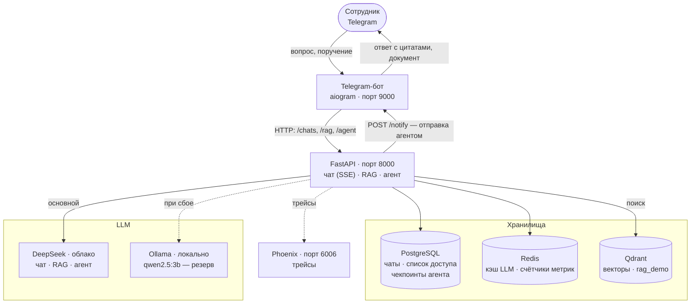

# IntelliBase

Корпоративная база знаний с AI-ассистентом: поиск и анализ внутренней
документации (PDF, DOCX, HTML, MD) с ответами, подкреплёнными цитатами, и
Telegram-агентом, который умеет не только отвечать, но и выполнять поручения —
например, отправить нужный документ коллеге.

## Демонстрация

**Видео-демонстрация (5 мин 40 с):** `https://disk.360.yandex.ru/d/L1cFtnIzGndRsg`

В записи: вопросы по базе со ссылками на источники, честный отказ на вопрос,
ответа на который в корпусе нет, поручение агенту с подтверждением и отправкой
файла двум получателям, отказ на постороннего получателя, трейсы в Phoenix
и метрики качества поиска.

**Презентация:** `https://disk.360.yandex.ru/d/L1cFtnIzGndRsg`

## Задача и пользователь

**Пользователь** — сотрудник компании, которому нужен ответ по внутренней
документации: технические требования подсистем, регламенты обмена, методики
расчёта, инструкции поддержки.

**Задача** — убрать ручной поиск по десяткам файлов. Документы лежат в разных
папках, названия не унифицированы, нужный фрагмент приходится искать
просмотром целых файлов. Поиск по ключевым словам не работает: пользователь
формулирует вопрос словами («укладываемся ли в норматив по времени?»), а в
документе написано «норматив не более 45 минут, фактическое значение 38 минут» —
общих слов у вопроса и ответа нет.

**Как это решается здесь.** Гибридный контур: векторный поиск находит
релевантные фрагменты по смыслу, LLM синтезирует ответ **только по найденному
контексту** и проставляет ссылки на источники. Если в корпусе нет ответа —
система честно отказывается отвечать, не выдумывая (score-guard, см. ниже).
Поверх поиска работает агент с инструментами: он может посмотреть каталог
документов, найти адресата по имени и отправить файл в Telegram — с
подтверждением человеком.

## Сценарии использования

**1. Вопрос по базе знаний.** Пользователь спрашивает в Telegram или через
`POST /rag/query`. Система находит фрагменты, отвечает и перечисляет
источники с номерами страниц:

> **Вопрос:** Каков статус и дата Версии 1.3 Регламента информационного обмена с ЦРСВЭД?
> **Ответ:** Версия 1.3 имеет дату 20.07.2026 и статус «Действует» [1].
> **Источник:** Регламент информационного обмена с ЦРСВЭД, стр. 1 (score 0.86)

**2. Поручение агенту с подтверждением.** Пользователь пишет обычным
сообщением: «Отправь ПС Малахит. Технические требования. Версия 1.9 мне и
Крутикову». Агент находит файл в корпусе, ищет получателей по именам, готовит
черновик и **останавливается** — показывает превью с файлом и адресатами и
ждёт нажатия «✅ Отправить». Только после подтверждения документ уходит
вложением. Это защита от ошибки: неверного адресата или не того файла видно
до отправки.

**3. Вопрос вне базы.** «Кто выиграл чемпионат мира по футболу 2022?» — ни один
фрагмент не проходит порог релевантности, LLM не вызывается вовсе, система
отвечает отказом за десятые доли секунды. Отказ дешевле и надёжнее
галлюцинации.

## Что умеет

- **RAG с цитатами** — ответ только по найденным фрагментам, ссылки на файл и
  страницу, честный отказ при низкой релевантности.
- **Диалоговый RAG** — вопросы с историей; follow-up («а для них?»)
  переписывается в самодостаточный поисковый запрос.
- **Агент на LangGraph** с шестью инструментами: поиск по базе, текущее время,
  каталог документов, поиск человека по имени, отправка текста и отправка
  файла. Два последних — с подтверждением человеком (HIL, `interrupt`/`resume`).
- **Персистентность** — история чатов в PostgreSQL, состояние агента в
  чекпоинтере: диалог и незавершённое подтверждение переживают перезапуск.
- **Telegram-бот** — единственный интерфейс для пользователя: обычные вопросы,
  `/agent` для поручений, доступ по списку пользователей.
- **Наблюдаемость** — трейсы в Arize Phoenix: один HTTP-запрос = один трейс со
  всеми шагами (retrieval, вызовы LLM, узлы графа агента, вызовы инструментов).
- **Безопасность** — модерация входящих (regex + OpenAI Moderation), rate limit,
  canary-токен в системном промпте, маскирование PII в логах и экспорте.
- **Отказоустойчивость** — при недоступности облачной модели запрос уходит на
  локальную (резервный провайдер), см. ADR-003.

## Архитектура



Эмбеддинги — `intfloat/multilingual-e5-large`, считаются локально внутри
приложения (sentence-transformers), отдельным сервисом не вынесены.

**Как проходит запрос** (вопрос по базе знаний):

1. Бот отправляет сообщение в `POST /chats/{id}/messages`.
2. Модерация входа: regex-блоклист → OpenAI Moderation (fail-open).
3. Condense: если есть история, follow-up переписывается в поисковый запрос.
4. Retrieval: Qdrant отдаёт top-K фрагментов по косинусному сходству
   (с опциональным фильтром по категории-подсистеме).
5. Score-guard: если лучший фрагмент ниже порога — ответ-отказ, LLM не
   вызывается.
6. Синтез: LLM отвечает по пронумерованному контексту, ставит ссылки `[1]`,
   `[2]`. Ответ и источники отдаются клиенту по SSE и сохраняются в историю.

**Агентный граф**: `call_model` → проверка инструмента → для опасных
инструментов `prepare_send` → `interrupt` (пауза на подтверждение) →
`confirm_and_send`. Схема графа — `docs/agent-graph-custom.mmd`,
разбор — `docs/agent-graph-report.md`.

## Быстрый старт

**Что нужно:** Docker с плагином compose (конфигурация стека — `compose.yaml`,
Docker Compose v2 читает его по умолчанию); 8–16 ГБ RAM; ~20 ГБ диска; интернет
(Docker Hub, HuggingFace — для скачивания embedding-модели). Команды ниже — через
`make`; если его нет (частая ситуация на Windows), те же шаги выполняются
командами `docker compose` — см. «Windows без make» после блока запуска.

Для запуска демонстрационного корпуса (`data/demo_kb` — 18 синтетических
документов в репозитории, реальные документы не нужны) выберите источник LLM.

**Вариант 1 — локально, без ключей: Ollama** (на CPU медленнее: RAG-ответ
2–4 минуты). Установите с [ollama.com](https://ollama.com/download), запустите
и скачайте модели:

```bash
ollama pull gemma3:4b      # чат
ollama pull qwen3:8b       # генерация RAG-ответов
ollama pull qwen2.5:3b     # резерв при сбое основной модели
```

**Вариант 2 — DeepSeek: облако, работает без VPN, быстро даже на CPU.**
Нужен ключ; агент по умолчанию использует DeepSeek (с резервом на Ollama).
Допишите в `.env`:

```bash
LLM__DEFAULT_PROVIDER=deepseek
LLM__DEFAULT_MODEL=deepseek-v4-flash
RAG_LLM_PROVIDER=deepseek
RAG_LLM_MODEL=deepseek-v4-flash
LLM__DEEPSEEK_API_KEY=sk-...
```

Запуск:

```bash
cp .env.example .env      # заполнить по выбранному варианту (см. выше)
make up                   # поднять стек и дождаться готовности
make smoke                # проверить живость: сервисы (app, bot), /health, Qdrant, Phoenix
make smoke-rag            # сквозной вопрос к RAG с проверкой источников
```

Первый запуск занимает 10–15 минут: сборка образа, скачивание embedding-модели
(~2.2 ГБ, из HuggingFace) и индексация демонстрационного корпуса из `data/demo_kb`.
Если модель уже скачана на хосте, укажите её кэш `HF_CACHE_DIR` в `.env` — старт
пройдёт без скачивания (см. `docs/runbook.md`).

**Windows без `make`** (а также без `cp`): те же шаги командами compose —
`copy .env.example .env`, затем:

```bash
docker compose up -d --build --wait
docker compose exec -T -e SMOKE_PHOENIX_URL=http://phoenix:6006 app python scripts/smoke.py
docker compose exec -T -e SMOKE_PHOENIX_URL=http://phoenix:6006 app python scripts/smoke.py --with-rag
```

| Сервис | Адрес |
|---|---|
| API (FastAPI) | http://localhost:8000 — `/health`, `/ready`, `/docs` |
| Phoenix (трейсы) | http://localhost:6006 |
| Qdrant | http://localhost:6333 |
| Telegram-бот | в составе стека, внутренний HTTP на порту 9000 |

**BOT_TOKEN для поднятия не обязателен.** Без него бот стартует в режиме
заглушки: его HTTP-порт жив, Telegram не опрашивается. Для живого бота возьмите
токен у [@BotFather](https://t.me/BotFather) и заполните `BOT_TOKEN`; чтобы бот
отвечал именно вам, добавьте свой chat_id в `BOT_ALLOWED_CHAT_IDS` — по
умолчанию бот закрыт для всех (см. `docs/runbook.md`, «Доступ к боту»).

Остальные команды — `make help` (для `make test` / `metrics` / `eval` на хосте
дополнительно нужен `uv`; для запуска стека он не требуется):

```bash
make smoke-rag    # smoke + сквозной вопрос к RAG (нужны LLM и корпус)
make test         # быстрые тесты (без PG и lifespan)
make test-all     # полный прогон (нужна поднятая инфраструктура)
make metrics      # p95 задержек, cache hit rate, последние числа RAGAS
make eval         # оценка качества RAG на демо-корпусе (RAGAS)
make thresholds   # сверить последний прогон с порогами качества
make ingest       # инкрементальная индексация корпуса
make reindex      # полная переиндексация
make users ARGS='list'   # доступ к боту: list | add <chat_id> "Имя" | remove
make logs / ps / shell / down / clean
```

## Демонстрационный корпус

`data/demo_kb` — 18 синтетических документов (9 PDF + 9 DOCX) в 7
категориях-подсистемах, ~1 МБ, полностью в git. Корпус сгенерирован
(`scripts/generate_demo_corpus.py`), чтобы проект запускался на чистом клоне
без реальных внутренних документов.

Рабочий корпус подключается через `RAG_DATA_DIR` в `.env` — около 70 документов
ФТС, 27 МБ (`docs/data_inventory.md`), в git не хранится.

**Примеры вопросов** (проверены на демо-корпусе, входят в датасет оценки):

- Каков статус и дата Версии 1.3 Регламента информационного обмена с ЦРСВЭД?
- Какой максимальный размер пакета при обмене по SFTP?
- Какие действия предусмотрены при сбое в соответствии с регламентом?
- Какие права предоставляет уровень доступа «Просмотр»?
- Кто выиграл чемпионат мира по футболу 2022? *(ответа в базе нет — ожидается отказ)*

Пример поручения агенту: «Отправь ПС Малахит. Технические требования.
Версия 1.9 мне и Крутикову» — приостановка с превью файла и адресатов,
подтверждение, отправка вложением.

## Переменные окружения

Все переменные с пояснениями — `.env.example` (полный справочник —
[docs/env.md](docs/env.md)). Ключевые:

| Переменная | По умолчанию | Назначение |
|---|---|---|
| `LLM__DEFAULT_PROVIDER` | `ollama` | провайдер чата: `ollama` / `deepseek` / `openai` / `openrouter` |
| `LLM__DEFAULT_MODEL` | `gemma3:4b` | модель чата (Ollama; облако — `deepseek-v4-flash`) |
| `LLM__DEEPSEEK_API_KEY` | `sk-...` | ключ DeepSeek (облако, без VPN) |
| `LLM__FALLBACK_PROVIDER` | `ollama` | резерв при недоступности основного; пусто — выключить |
| `LLM__FALLBACK_MODEL` | `qwen2.5:3b` | модель резерва |
| `RAG_DATA_DIR` | `data/demo_kb` | каталог корпуса (папка верхнего уровня = категория) |
| `RAG_COLLECTION` | `rag_demo` | коллекция Qdrant |
| `RAG_LLM_PROVIDER` | `ollama` | провайдер синтеза RAG: `ollama` / `deepseek` / `openai` |
| `RAG_LLM_MODEL` | `qwen3:8b` | модель синтеза RAG (на CPU ~2–4 мин на ответ; облако — `deepseek-v4-flash`) |
| `RAG_CHUNK_SIZE` / `RAG_CHUNK_OVERLAP` | `512` / `64` | параметры чанкинга (выбор обоснован в docs/chunking_experiment.md) |
| `RAG_TOP_K` | `10` | ширина retrieval |
| `RAG_SCORE_THRESHOLD` | `0.78` | порог релевантности (демо-корпус; рабочий — `0.80`, см. `docs/rag.md`): ниже — честный отказ без вызова LLM |
| `RAG_PDF_PARSER` | `inspector` | извлечение текста из PDF: `inspector` (pdf-inspector, Rust) / `pymupdf` |
| `RAG_ENABLE_CHAT` | `true` | RAG в чате бота (false — обычный LLM-чат) |
| `CHAT_REPOSITORY` | `json` | хранилище чатов: `json` (JSONL) / `postgres` |
| `DATABASE_URL` | `postgresql+asyncpg://...` | подключение к PostgreSQL |
| `REDIS_URL` | `redis://127.0.0.1:6379/0` | кэш LLM и счётчики метрик |
| `QDRANT_URL` | `http://127.0.0.1:6333` | векторное хранилище |
| `EMBEDDING_MODEL` | `intfloat/multilingual-e5-large` | embedding-модель (локально) |
| `BOT_TOKEN` | — | токен Telegram-бота от @BotFather |
| `ADMIN_TOKEN` / `INTERNAL_TOKEN` | `change-me-...` | токены админ-API и bot↔backend |
| `PHOENIX_ENABLED` | `false` | трассировка (в compose включена) |
| `AGENT_CHECKPOINTER` | `sqlite` | чекпоинтер агента: `sqlite` / `postgres` |

## Тесты и качество

**Тесты** — 451 (448 passed, 3 skipped), pytest:

```bash
make test         # быстрый прогон (без внешних API; PG/Qdrant-тесты скипаются, если не подняты)
make test-all     # полный прогон, включая интеграционные (нужны стек и сеть)
```

**Качество поиска** — RAGAS на 27 эталонных вопросах демо-корпуса
(`make eval`, метрики — `make metrics`):

| Метрика | Значение |
|---|---|
| Faithfulness | 0.952 |
| Answer relevancy | 0.881 |
| Context precision | 0.705 |
| Context recall | 0.864 |
| Наличие цитаты | 1.000 (27/27) |

Пороги зафиксированы в `eval/thresholds.yaml` (`make thresholds` — гейт).
Разбор неудачных строк и эксперименты (чанкинг, выбор модели) —
[docs/rag_evaluation.md](docs/rag_evaluation.md).

**Эксплуатационные метрики** — `make metrics`: p95 задержек, cache hit rate,
доля отказов RAG. Оговорка: `cache hit rate` считается по кэшу ответов, который
покрывает только `POST /chat` (legacy) — в чате бота, в RAG и у агента кэша нет,
см. [docs/limitations.md](docs/limitations.md), раздел 3.

## Документация

| Документ | Содержание |
|---|---|
| [ARCHITECTURE.md](ARCHITECTURE.md) | Карта модулей, потоки данных, схема БД, порты |
| [docs/README.md](docs/README.md) | Индекс всей документации |
| [docs/architecture.md](docs/architecture.md) | ADR: принятые и отклонённые решения |
| [docs/rag.md](docs/rag.md) | RAG-контур, score-guard, сравнение с реализацией без фреймворка |
| [docs/rag_evaluation.md](docs/rag_evaluation.md) | Оценка качества: RAGAS, эксперименты, failure analysis |
| [docs/chunking_experiment.md](docs/chunking_experiment.md) | Сравнение стратегий чанкинга |
| [docs/embeddings.md](docs/embeddings.md) | Выбор embedding-модели |
| [docs/vector_store.md](docs/vector_store.md) | Qdrant: конфигурация и метрика близости |
| [docs/agent-graph-report.md](docs/agent-graph-report.md) | Агент на LangGraph: схема, бенчмарк, баг при отладке |
| [docs/agent-persistent-report.md](docs/agent-persistent-report.md) | Персистентность, HIL, SSE, time-travel |
| [docs/multi-agent-report.md](docs/multi-agent-report.md) | Мультиагент против одного агента: замеры и решение |
| [docs/runbook.md](docs/runbook.md) | Операционные команды и типовые сбои |
| [docs/env.md](docs/env.md) | Справочник переменных окружения |
| [docs/testing.md](docs/testing.md) | Карта тестов |
| [docs/limitations.md](docs/limitations.md) | Ограничения: где система не работает и почему |

## Ограничения

Коротко о главном (подробно — [docs/limitations.md](docs/limitations.md)):

- **Доступ к API.** Бэкенд доверяет заголовку `X-Owner-External-Id`, который
  проставляет бот. При публикации порта 8000 наружу проверку доступа в боте
  можно обойти прямым HTTP-вызовом.
- **Подтверждение отправки.** Одобряет инициатор запроса — защита от ошибки
  системы, но не «четыре глаза»: пользователь с доступом к боту может
  одобрить собственную рассылку. Круг получателей ограничен серверным списком.
- **Сканы.** Страницы PDF без текстового слоя в индекс не попадают — OCR не
  подключён, такие страницы пропускаются.
- **Реранкер выключен** по умолчанию (модель ~2.2 ГБ); включается флагом
  `RAG_RERANK_ENABLED`.
- **Локальный резерв медленный.** Ollama на CPU отвечает 15–20 с вместо ~2 с у
  облачной модели: резерв спасает от отказа, но не заменяет облако по скорости.
