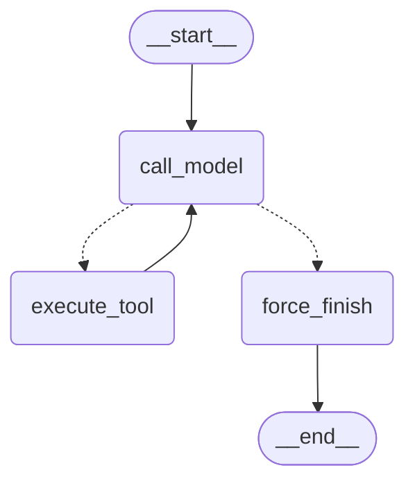

# Отчёт ДЗ 6.3 — LangGraph: ReAct на графе


## 1. Конфигурация

| Параметр | Значение |
|---|---|
| Провайдер LLM | DeepSeek (через `langchain_openai.ChatOpenAI`) |
| Модель агента | `deepseek-v4-flash` |
| Temperature | 0 |
| MAX_ITERATIONS | 6 |
| Инструменты | `search_knowledge_base` (RAG по корпусу ФТС), `get_current_time`, `send_telegram_message` (заглушка) |
| LangGraph | `1.2.2` |
| LangChain | `1.3.2` (`langchain-openai` 1.3.4) |
| Baseline Б6.2 | `agent_react.run_react_with_reflection` (тот же провайдер/модель) |

RAG-инструмент использует `RAG_LLM_PROVIDER=deepseek`, `RAG_LLM_MODEL=deepseek-v4-flash`,
embed-модель `intfloat/multilingual-e5-large`, коллекция `rag_block_05`.

---

## 2. State contract

| Поле | Тип | Reducer | Зачем |
|---|---|---|---|
| `messages` | `Annotated[list[AnyMessage], add_messages]` | `add_messages` (добавление + update по `id`) | история диалога — без `add_messages` перезаписывалась бы на каждом шаге |
| `iteration_count` | `int` | replace (по умолчанию) | счётчик итераций для стоп-крана |
| `tool_results` | `Annotated[list[dict], operator.add]` | `operator.add` (накопление) | лог вызовов инструментов для отчёта/трейсинга |

---

## 3. Router и stop conditions

`route_after_model(state) -> Literal["execute_tool", "force_finish"]` — синхронная
чистая функция, только читает state:

1. `iteration_count >= MAX_ITERATIONS` → `"force_finish"`;
2. у последнего сообщения есть `tool_calls` → `"execute_tool"`;
3. иначе → `"force_finish"`.

Stop conditions: (а) модель ответила без `tool_calls`; (б) исчерпан лимит 6 итераций.
Оба пути упираются в `force_finish`, который при «обрыве» на `tool_calls` дописывает
`AIMessage("Превышен лимит итераций")` — граф не уходит в END молча.

---

## 4. Mermaid-схема кастомного графа



Содержимое файла: `docs/agent-graph-custom.mmd`.

---

## 5. Таблица бенчмарка (5 задач × 3 реализации, по 3 прогона)

| # | Задача | Реализация | latency_ms | prompt_tokens | completion_tokens | total_steps |
|---|--------|-----------|-----------:|--------------:|------------------:|------------:|
| 1 | Что такое ЭТР… | react (Б6.2) | 43620.1 | 4679 | 1805 | 2 |
| 1 | Что такое ЭТР… | custom | 13938.6 | 2840 | 593 | 2 |
| 1 | Что такое ЭТР… | prebuilt | 13105.4 | 2241 | 194 | 2 |
| 2 | Что такое ЦПР… | react (Б6.2) | 49524.7 | 3873 | 1947 | 2 |
| 2 | Что такое ЦПР… | custom | 81828.0 | 2997 | 719 | 2 |
| 2 | Что такое ЦПР… | prebuilt | 26501.5 | 3353 | 398 | 2 |
| 3 | ТН ВЭД + отправка… | react (Б6.2) | 61767.2 | 10429 | 1893 | 4 |
| 3 | ТН ВЭД + отправка… | custom | 8908.3 | 4287 | 463 | 3 |
| 3 | ТН ВЭД + отправка… | prebuilt | 8027.2 | 4236 | 363 | 3 |
| 4 | время + отправка… | react (Б6.2) | 11501.7 | 3644 | 982 | 3 |
| 4 | время + отправка… | custom | 3034.5 | 2554 | 264 | 3 |
| 4 | время + отправка… | prebuilt | 3142.6 | 2580 | 210 | 3 |
| 5 | хокку (провокация) | react (Б6.2) | 3599.1 | 880 | 365 | 1 |
| 5 | хокку (провокация) | custom | 4789.6 | 713 | 364 | 1 |
| 5 | хокку (провокация) | prebuilt | 2477.5 | 735 | 137 | 1 |

`latency_ms` — среднее по 3 прогонам; токены/шаги — с последнего прогона.

---

## 6. Custom vs prebuilt

Что пришлось писать руками в `custom_graph`: `AgentState`, три узла
(`call_model`/`execute_tool`/`force_finish`), router, сборка рёбер, стоп-кран.

Что `create_agent` сделал сам: внутренний ReAct-цикл (взаимодействие model и tools), обработку
`tool_calls`/`ToolMessage`, системный промпт.

Вывод по своим числам (таблица раздела 5):

- **react (Б6.2) — самый дорогой.** На RAG-задачах (1–3) latency 43–62 сек, completion
  1805–1947 токенов. Причина — critic-вызов и reflexion-цикл, которых в графах нет.
  На задаче 3 react сделал 4 шага против 3 у графов.
- **prebuilt — стабильно лучший.** На задачах 1–2 быстрее custom (13105 vs 13939 мс;
  26502 vs 81828 мс) при меньшем completion (194 vs 593; 398 vs 719 токенов). На
  задачах 3–4 latency сравнима, но токены ниже.
- **custom близок к prebuilt.** Выброс 81.8 сек на задаче 2 — аномалия одного прогона
  (сетевой джиттер/retry у провайдера), а не систематический проигрыш.

**Что оставить в дипломе.** `prebuilt_graph` (`create_agent`) как основной путь — выигрывает
по latency и токенам при меньшем объёме собственного кода. Кастомный `StateGraph` оставляю
как задел под случаи, где нужен контроль над router, stop-условиями, subgraph или checkpointer.

---

## 7. Найденный баг при отладке

**Симптом.** В бенчмарке колонка `tools` у реализации `custom` была пустой (`-`), хотя
инструмент `search_knowledge_base` вызывался, а ответ возвращался корректный. У `react`
и `prebuilt` имена инструментов при этом выводились.

**Причина.** В узле `execute_tool` результат инструмента оборачивался в
`ToolMessage(content=..., tool_call_id=...)` — без поля `name`. Бенчмарк читает имя
инструмента через `m.name` у всех `ToolMessage`, а у сообщения без `name` оно `None` и
отфильтровывается. То есть граф работал, но терял метаданные о том, какой инструмент
вызывался, — эти данные нужны для отчёта и трейсинга.

**Фикс.** Одна строка — передать имя инструмента в `ToolMessage`:

```python
messages.append(ToolMessage(content=content, tool_call_id=call["id"], name=call["name"]))
```

Вывод: даже при корректной работе `ToolMessage` без `name` теряет информацию о вызванном
инструменте, которая понадобится и для цитирования, и для мониторинга.

---

## 8. Что блокирует переход к персистентности / чекпойнтингу

- `thread_id` уже передаётся в `config` (`bench-<id>`), но без checkpointer это
  ничего не даёт: значение никуда не сохраняется.
- Чтобы состояние сохранялось и прогон можно было продолжить после сбоя, нужно
  подключить checkpointer — `AsyncPostgresSaver` (PostgreSQL в проекте есть) или более
  простой `AsyncSqliteSaver`. После этого тот же `ainvoke(..., config=...)` начнёт
  писать состояние и подхватывать его при повторе.
- `tool_results` — список словарей `{name, args, result}`, он JSON-совместим и
  сериализуется. Но `result` бывает длинным, поэтому на будущее стоит его обрезать —
  как это уже сделано в 6.2.

---

## 9. Воспроизведение

Предусловия: поднята инфраструктура (Qdrant, Ollama), в `.env`
задан `RAG_LLM_PROVIDER=deepseek` и `RAG_LLM_MODEL=deepseek-v4-flash`.

```bash
# отключить сетевой чек HuggingFace (модель уже в кеше)
HF_HUB_OFFLINE=1 uv run python scripts/bench_agents.py --runs 3 --sleep 1 \
  --out dev_tasks/bench-6-3.jsonl --log dev_tasks/bench-6-3.log

# пересобрать markdown-таблицу для раздела 5 из JSONL
uv run python dev_tasks/gen_bench_table.py --in dev_tasks/bench-6-3.jsonl

# схема графов
uv run python scripts/visualize_graph.py

# самопроверка
uv run python dev_tasks/verify_6_3.py
```

Средняя latency и токены зависят от провайдера и сети, поэтому точные цифры при
повторе могут отличаться.

---

