# Схема supervisor-графа (Б6.5)

Схема **сгенерирована из кода**, а не нарисована руками: `experiments/multi_agent_langgraph.py`
сохраняет в этот файл результат `app.get_graph().draw_mermaid()`. Воспроизвести:

```bash
uv run python -m experiments.multi_agent_langgraph     # перезапишет схему ниже
```

Что на схеме:

- `supervisor` — узел-координатор: решает, кому делегировать шаг, и завершает работу
  (`supervisor -.-> __end__`);
- `researcher` — агент с инструментом `search_knowledge_base`, собирает факты и нумерует источники;
- `writer` — агент без инструментов, оформляет финальный ответ со ссылками `[1]`, `[2]`;
- пунктирные рёбра — условные переходы (маршрутизация супервизора), сплошные — безусловные
  (возврат агента к супервизору после завершения шага).

Маршрутизация и передача управления обеспечиваются пакетом `langgraph-supervisor`: он сам
создаёт handoff-инструменты `transfer_to_researcher` / `transfer_to_writer`, которые модель
супервизора вызывает как обычные tools.

```mermaid
---
config:
  flowchart:
    curve: linear
---
graph TD;
	__start__([<p>__start__</p>]):::first
	supervisor(supervisor)
	researcher(researcher)
	writer(writer)
	__end__([<p>__end__</p>]):::last
	__start__ --> supervisor;
	researcher --> supervisor;
	supervisor -.-> __end__;
	supervisor -.-> researcher;
	supervisor -.-> writer;
	writer --> supervisor;
	classDef default fill:#f2f0ff,line-height:1.2
	classDef first fill-opacity:0
	classDef last fill:#bfb6fc

```

<!-- BEGIN: draw_mermaid -->

<!-- END: draw_mermaid -->

> Результат сравнения этого графа с single-agent baseline и решение по agent-слою диплома —
> в [multi-agent-report.md](multi-agent-report.md).
