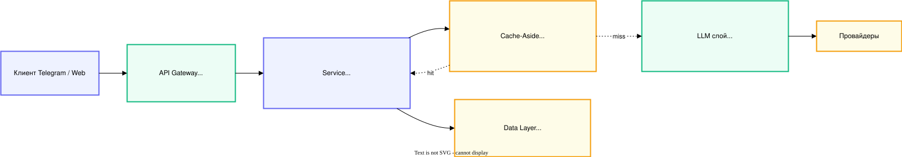

# Архитектура приложения

## ADR

### ADR-001: Выбор паттерна взаимодействия

**Context.** Проект — ассистент в Yandex messenger и web-интерфейсе для поиска и анализа документов
в корпоративной базе знаний (с использованием RAG). Ожидаемая нагрузка — 30 сообщений/мин в пике, в среднем 1500 запросов в сутки.
Средний ответ — 300–500 токенов (2–6 секунд генерации), бюджет 600 руб/мес (в случае недоступности модели Ollama и работы через GigaChat).

**Decision.** Выбран **Streaming через SSE**. Бот в мессенджере редактирует
сообщение по мере прихода токенов (паттерн edit-message), аналогично streaming поддерживается web-интерфейсом.

**Consequences.**

- Плюсы: TTFT 200–600 мс — пользователь сразу видит реакцию.
- Минусы: на nginx нужно отключить proxy_buffering; FastAPI держит
  открытое соединение 5–10 сек на каждого пользователя (но asyncio это держит).

**Alternatives.**

- Request-Response — отвергнут, 5–10 секунд молчания в чате — плохой UX.
- Queue-based — отвергнут, для интерактивного чата избыточно: добавляет polling
  и убивает «печать в реальном времени».

### ADR-002: Стратегия fault tolerance — ~~отклонён~~ (исторический)

> **Статус: не реализовано.** Этот ADR описывал схему, до кода не дошедшую:
> circuit breaker `aiobreaker` в проекте не используется, GigaChat не
> подключён, LiteLLM-прокси в стеке не поднят (см. `compose.yaml`). Оставлен
> как история решения; актуальное состояние — ADR-003.

**Decision (предполагавшееся).** Primary — gemma3:4b. Fallback — GigaChat Pro по
подписке pay-as-you-go (на случай временной недоступности Ollama).
Circuit Breaker — `aiobreaker`, fail_max=5, timeout=60s, по одному на провайдера.
Cache-Aside в Redis, TTL 1 час, ключ — `sha256(model + messages + temperature)`.

**Consequences.** Стоимость GigaChat: 0.5 руб за 1000 токенов, но не менее
600 рублей в месяц при использовании в течение месяца.

**Почему не пошли.** GigaChat требовал отдельной подписки и прокси, а к моменту
реализации отказоустойчивости основным провайдером стал DeepSeek (работает без
VPN) — резервом логичнее держать локальную Ollama, которая уже поднималась для
эмбеддингов и RAG. Circuit breaker на один процесс не даёт выигрыша: ретраи с
backoff закрывают тот же сценарий проще.

### ADR-003: Отказоустойчивость LLM (реализовано)

**Context.** Основной провайдер — облачный DeepSeek (чат, синтез RAG, модель
агента). Его недоступность (нет сети, таймаут, 429, отклонённый ключ) означала
полный отказ: пользователь получал ошибку, а демонстрация ломалась. Рядом уже
работает локальная Ollama — на ней собран резерв.

**Decision.** Три уровня, снизу вверх:

1. **Ретраи** — 3 попытки с экспоненциальным backoff (`tenacity`) на
   `APIConnectionError`, `APITimeoutError`, `RateLimitError`.
2. **Резервный провайдер** — после исчерпания ретраев запрос уходит на
   `LLM__FALLBACK_PROVIDER` / `LLM__FALLBACK_MODEL` (по умолчанию
   `ollama` / `qwen2.5:3b`). Действует в трёх путях к модели: чат бота
   (`app/chat/service.py`), синтез RAG (`app/services/rag.py`) и агент
   (`app/main.py`, штатный `with_fallbacks` из LangChain).
3. **Cache-Aside в Redis** — TTL 1 час, ключ `sha256(model + messages + temperature)`
   (`app/services/llm.py`), плюс счётчики hit/miss для метрик.

**Что резервом НЕ подменяется.** Ошибка фильтра контента — ответ провайдера по
существу запроса: другой провайдер ответит так же, а смена модели ради обхода
фильтра — уже не отказоустойчивость. Ошибка формата запроса (400) и неизвестные
исключения — наша ошибка: повтор на другой модели её не исправит, только
замаскирует от тестов. Классификация — `app/services/llm_fallback.py`.

**Consequences.**

- Плюсы: падение облака не роняет чат, RAG и агента; резерв локальный, без
  ключей и без прокси; подмену видно в логе (`LLM-провайдер недоступен (...)`)
  и в Phoenix-трейсе.
- Минусы: Ollama на CPU отвечает минутами — резерв спасает от отказа, но не
  заменяет облако по скорости. Резерв подхватывает создание стрима, но не
  разрыв посреди уже начатого ответа (иначе пользователь увидел бы текст дважды).
- Резерв выключается пустой `LLM__FALLBACK_PROVIDER`; совпадение резерва с
  основным провайдером подмены не даёт.

## Потенциальные точки отказа

**API Gateway**: недоступность одной из точек взаимодействия (мессенджер, web-интерфейс) → работаем через вторую

**Service**: сервис неработоспособен → отображаем соответствующее сообщение пользователю

**LLM**: основной провайдер недоступен → 3 ретрая с backoff → резервный
провайдер (ADR-003) → если и он лежит, отображаем соответствующее сообщение
пользователю

**Data**: недоступен кеш → для ответов задействуем LLM (fail-soft), недоступна база знаний → отображаем соответствующее сообщение пользователю

## LiteLLM — не используется (исторический раздел)

[Конфигурация LiteLLM](litellm/config.yaml) осталась от первоначального плана
(ADR-002): единый интерфейс к провайдерам и функции отказоустойчивости из коробки.
В текущем стеке LiteLLM-прокси **не поднят** — в `compose.yaml` его нет.
Провайдеры подключаются напрямую клиентами `AsyncOpenAI` (все они
OpenAI-совместимые), а отказоустойчивость реализована в приложении (ADR-003).
