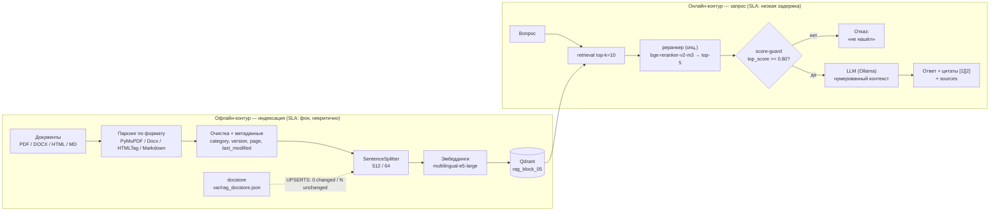
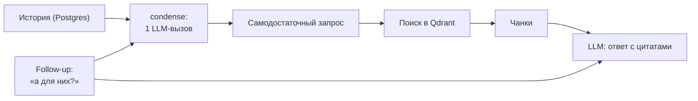

# RAG на LlamaIndex — отчёт по ДЗ 5.3

Минимальный, но рабочий RAG поверх дипломного сервиса: корпус из 10 документов
предметной области (ФТС) индексируется в Qdrant через LlamaIndex, ответ строится
строго по найденному контексту с цитатами на источники. Параллельно тот же запрос
реализован «руками» (без фреймворка) — для сравнения.

## Корпус

`data/rag-block-03/` — 10 документов: 9 реальных заявок/функциональных требований
из домена ФТС (скопированы из `data/orig_docs/` с короткими именами) + 1 заведомо
нерелевантный файл для проверки fallback.

| Файл | Содержание |
|------|-----------|
| `kps_tarify_ree_ois.docx` | ФТ на КПС «Тарифы — Реестр ОИС» (выборки из ДТ, расширенный реестр) |
| `prikaz_665_rois.pdf` | Заявка по приказу ФТС № 665 (приостановление выпуска товаров с ОИС) |
| `sertif_verifikaciya.pdf` | Верификация сертификатов о происхождении товаров |
| `sertif_voprosy_npk.docx` | Вопросы/НПК к ФТ «Сертификаты происхождения» |
| `malahit_metodika_13.docx` | Методика 13 (сроки приостановления выпуска) в ИСС «Малахит» |
| `malahit_metodika_14.docx` | Методика 14 (выявление контрафакта) в ИСС «Малахит» |
| `trois_ekspertiza.pdf` | Доработка АИС БД «Экспертиза» + ТРОИС |
| `parallelny_import.docx` | Витрина товаров, разрешённых к параллельному импорту |
| `1893_38_zapret.pdf` | Изменение формы 38-запрет (статотчётность) |
| `offtopic_recipe.md` | **Нерелевантный**: рецепт борща |

## Зависимости

Ставится метапакет-бандл плюс интеграции, которых в бандле нет. Так как в роли
эмбеддингов выбран HuggingFace (обоснование из Б5.1), добавлена HF-интеграция.

```bash
uv add llama-index                         # бандл: ядро + OpenAI LLM/эмбеддинги
uv add llama-index-vector-stores-qdrant    # интеграция с Qdrant
uv add llama-index-readers-file            # парсеры PDF / DOCX / HTML
uv add llama-index-embeddings-huggingface  # эмбеддинги HuggingFace (E5)
uv add docx2txt                            # DOCX-парсер SimpleDirectoryReader
```

Зафиксированные версии (проверены на живом Qdrant + Ollama):

| Пакет | Версия |
|-------|--------|
| `llama-index` (бандл) | 0.14.23 |
| `llama-index-core` | 0.14.23 |
| `llama-index-embeddings-huggingface` | 0.7.0 |
| `llama-index-llms-openai` | 0.7.10 |
| `llama-index-vector-stores-qdrant` | 0.10.3 |
| `llama-index-readers-file` | 0.6.0 |
| `docx2txt` | 0.9 |
| `qdrant-client` | 1.18.0 |
| `openai` | 2.38.0 |
| `sentence-transformers` | 5.6.0 |

Модели: эмбеддинги `intfloat/multilingual-e5-large` (dim 1024, локально), LLM
`gemma3:4b` через Ollama (`temperature=0`). Всё настраивается в `app/core/config.py`
/ `.env`, не хардкодом.

## Решение по коллекции

Коллекция из предыдущего блока (`documents`) **не переиспользуется**. Причины:

1. Другой корпус (2028 чанков по всем ФТ против 10 документов этого блока) —
   сравнивать ответы на разных данных нельзя.
2. Она наполнялась напрямую через `qdrant-client` с плоским payload
   `{source, text, ps, year, created_at}`. LlamaIndex хранит ноды в своём формате
   (`_node_content` с метаданными и связями), поэтому при подключении к «чужой»
   коллекции через `from_vector_store` метаданные и цитаты `source_nodes` неполны.

Заведены две отдельные коллекции на одном корпусе и одной embed-модели:

| Коллекция | Кто пишет | payload | Зачем |
|-----------|-----------|---------|-------|
| `rag_block_03` | LlamaIndex (`from_documents`) | `_node_content` + `file_name` | прод-путь `/rag/query`, диплом |
| `rag_block_03_bare` | `qdrant-client` напрямую | плоский `{text, source}` | сравнение «руками» |

Обе: dim 1024, distance COSINE. Индексация идемпотентна — при непустой коллекции
переиндексация не запускается (`from_vector_store` / проверка `count() > 0`).

## LlamaIndex vs bare-metal

| Критерий | LlamaIndex (`rag.py`) | Bare-metal (`rag_baremetal.py`) |
|----------|------------------------|----------------------------------|
| Строк кода (ingestion + query, без импортов) | ~29 | ~95 |
| Поддержка форматов из коробки | PDF/DOCX/MD через `SimpleDirectoryReader` + `readers-file` | свой `_read_text` с `pypdf`/`python-docx` |
| Что дописать для PDF/DOCX | ничего (уже есть `readers-file` + `docx2txt`) | ветвление по расширению и парсеры руками |
| Batch-ingestion / async | `IngestionPipeline(num_workers=...)`, `aquery()` из коробки | батчинг и async-обвязка пишутся вручную |
| Дебаг top_score / source_nodes | `response.source_nodes` (`.score`, `.metadata`, `.node.get_content()`) | сырые `hits` из `query_points` — видно сразу, но без структуры нод |
| Подмена компонентов (re-ranker, chunker) | `node_postprocessors=[...]`, сменный `node_parser` | каждый шаг переписывается руками |
| Чанкинг | `SentenceSplitter` (по предложениям, overlap) | наивный: фикс. окно 1200 симв., без overlap |

**Вывод.** В дипломе остаётся LlamaIndex-версия: на том же корпусе она короче в ~3
раза, сразу даёт структурированные `source_nodes` для цитат и мониторинга и
позволяет менять чанкер/реранкер/режим синтеза без переписывания пайплайна.
Bare-metal ценен как способ понять, что фреймворк — не магия (тот же
`read → chunk → embed → upsert → search → prompt → LLM`), и как запасной путь, когда
нужен полный контроль над payload. Качество ответов сопоставимо (обе реализации на
одних вопросах дали верный top-1 источник).

## Прогон 5 вопросов

Запуск: `uv run python -m app.services.rag` (демо) и прогон обеих реализаций.
Порог fallback `RAG_SCORE_THRESHOLD=0.5` + инструкция «отвечай только по контексту»
в системном промпте. Значения ниже — из LlamaIndex-версии.

| # | Тип | Вопрос | Ответ (кратко) | top-1 source / score | Релевантно | Гипотеза |
|---|-----|--------|----------------|----------------------|------------|----------|
| 1 | хороший | Что входит в состав КПС «Тарифы — Реестр ОИС»? | перечень структурных подразделений и интеграций (АИСТ-М, ИАС «Тарифы-1», НСИ, ЦБД ДТ, ЛК) | `kps_tarify_ree_ois.docx` / 0.876 | да | название ПС из вопроса — дословно наименование документа |
| 2 | хороший | Как выполняется верификация сертификатов о происхождении товаров? | направление скана сертификата по вертикали до ФТС + верификационный запрос | `sertif_verifikaciya.pdf` / 0.860 | да | термин «верификация сертификатов» встречается в документе дословно |
| 3 | хороший | Какие изменения вносятся в форму 38-запрет? | изменение столбцов таблиц 1 и 5 формы 38-запрет | `1893_38_zapret.pdf` / 0.859 | да | «38-запрет» — уникальный термин, однозначно в нужном документе |
| 4 | средний | Какие методики планового мониторинга используются в ИСС «Малахит»? | методики показателей № 6–14 (синтез из двух заявок) | `malahit_metodika_13.docx` / 0.864 (+ `malahit_metodika_14.docx` в топ-3) | да | ответ размазан по двум документам (методики 13 и 14); LLM синтезирует общий заголовок, а не конкретику каждого показателя |
| 5 | вне базы | Какая завтра погода в Москве? | «В контексте нет информации о погоде в Москве» | `sertif_voprosy_npk.docx` / 0.715 | нет (и не должно) | fallback сработал через промпт-инструкцию, не через порог |

**Про fallback.** Порог 0.5 — намеренно консервативный и фактически «не срабатывает»
для E5: у `multilingual-e5-large` косинусная близость сжата к единице — релевантные
пары дают ~0.83–0.88, а совсем нерелевантный запрос («погода») всё равно получает
top-1 ≈ 0.71. Поэтому основной предохранитель — инструкция в промпте
«если ответа в контексте нет — честно скажи, что не нашёл», а порог по score — лишь
бэкап для совсем далёких запросов. На вопросе про погоду модель сама сказала
«нет информации», не выдумывая, хотя top-1 выше порога. Для OpenAI-эмбеддингов из
референса шкала другая (off-topic ≈ 0.17), там порог 0.3 отрезал бы больше — поэтому
порог вынесен в конфиг и калибруется под модель.


---

# Корпоративный RAG-ассистент — отчёт по Блоку 5.5

Корпоративный RAG поверх дипломного сервиса: офлайн-контур индексации
(`IngestionPipeline` + UPSERTS) и онлайн-контур запроса (retrieval → score-guard
→ генерация с цитатами). Два независимых контура, единственная граница между
ними — векторное хранилище Qdrant.

## Архитектура: два независимых контура



Два контура живут в разных процессах: индексация — фоновая (`scripts/ingest.py`,
`POST /documents/*`), запрос — онлайн (`POST /rag/query`, `POST /chats/{id}/messages`).

## Контур индексации

### Парсинг по форматам

`app/services/ingestion.py` маршрутизирует файлы по расширению на
специализированные ридеры LlamaIndex:

| Формат | Ридер | Особенность |
|--------|-------|-------------|
| PDF | `PyMuPDFReader` | один Document на страницу → в цитатах есть номер страницы |
| DOCX | `DocxReader` | стили, таблицы |
| HTML | `HTMLTagReader` | выгрузки Confluence/Notion |
| MD | `MarkdownReader` | README/runbook |

Перед чанкингом текст очищается (`clean`): убираются колонтитулы
(`Стр. 12 из 47`), склеиваются переносы (`авто-\nмобиль`), нормализуются
переводы строк, вырезаются URL.

### Метаданные из путей и файла

`file_metadata` обогащает каждый документ: `source` (имя файла), `category`
(папка верхнего уровня корпуса), `doc_type` (расширение), `version` (год из имени),
`visibility`, `last_modified` (из `stat().st_mtime`).

Технические/шумные поля исключаются из эмбеддинга через
`excluded_embed_metadata_keys` (`file_path`, `source`, `page`, `version`,
`last_modified`, …). `category` остаётся в эмбеддинге — это осмысленная
семантическая метка, помогающая поиску.

> **Про идемпотентность.** `doc.hash` в LlamaIndex зависит от метаданных, поэтому
> в метаданные НЕ кладётся меняющееся от запуска к запуску поле (типа
> `indexed_at=date.today()`). Используется `last_modified` из stat-файла — он
> стабилен, пока файл не менялся, и UPSERTS корректно пропускает неизменённое.

### Параметры чанкинга (из ДЗ 5.4)

`SentenceSplitter(chunk_size=512, chunk_overlap=64)` — конфигурация, выбранная
по итогам эксперимента `docs/chunking_experiment.md` (Hit@5=1.0, MRR@10=0.951,
Recall@10=0.979 на golden-set из 20+ вопросов).

### IngestionPipeline + UPSERTS

```python
IngestionPipeline(
    transformations=[SentenceSplitter(512, 64), HuggingFaceEmbedding("multilingual-e5-large")],
    docstore=SimpleDocumentStore(persist),      # var/rag_docstore.json
    vector_store=QdrantVectorStore("rag_block_05"),
    docstore_strategy=DocstoreStrategy.UPSERTS,
)
```

Повторный запуск `scripts/ingest.py` показывает **0 changed, N unchanged** —
дедуп по `doc.id_` + `doc.hash`, переэмбеддинг только изменённых документов.

### Инкрементальная переиндексация

- `POST /documents/upload` — загрузка одного файла, индексация в `BackgroundTasks`
  (202 Accepted, файл доступен в ответах через 30–60 с).
- `POST /documents/reindex` — `full` (вычистить и заново), `incremental`
  (UPSERTS по хешам), `files` (точечно).
- Упавший файл изолируется в `.failed` и виден в логах.

## Контур запроса

### retrieval → score-guard → синтез

1. **Retrieval**: `rag_top_k=10` ближайших чанков из Qdrant.
2. **Реранкер** (опционально, `rag_rerank_enabled=false` по умолчанию):
   `BAAI/bge-reranker-v2-m3` пересортировывает top-10 и оставляет top-5.
   Без него — dense-топ обрезается до `rag_rerank_top_n=5`. Тяжёлая зависимость
   (~2.2 ГБ), поэтому выключена и включается флагом.
3. **Score-guard**: если `max(score) < rag_score_threshold` — LLM не вызывается,
   сразу отдаётся отказ. Двухслойная защита: код + промпт.
4. **Синтез**: нумерованный контекст + `CITATION_QA_TEMPLATE` → LLM ставит
   цитаты `[1]`, `[2]`; `parse_citations` разворачивает их в
   `[1 — file.pdf]`.

### Порог отказа (`rag_score_threshold`)

**0.80** — обоснован распределением top-1 score на корпусе (E5
`multilingual-e5-large`, косинус нормализован):

| Тип запроса | top-1 score |
|-------------|-------------|
| Релевантные (5 вопросов по ФТС) | 0.837 – 0.867 |
| Вне-базы (4 вопроса: погода, борщ, футбол, пицца) | 0.737 – 0.787 |

У E5 косинусная близость сжата к единице: релевантное ~0.84, off-topic ~0.76.
Порог 0.80 лежит в зазоре между ними и отсекает вне-базы запросы ДО вызова LLM.
Для OpenAI `text-embedding-3-small` шкала другая (off-topic ≈ 0.17) — порог
калибруется заново под конкретную модель. Помимо score-guard'а, от галлюцинации
страхует промпт («если ответа нет — честно скажи»).

### Цитаты и sources

Контракт `answer()` — `{answer, top_score, sources, confident}`:

```json
{
  "answer": "КПС «Тарифы — Реестр ОИС» включает структурные подразделения и интеграции [1 — окончательный вариант кпс ТАРИФЫ РЕЕСТР ОИС (+НПКИ+УТОВЭК).docx].",
  "top_score": 0.86,
  "sources": [
    {"id": 1, "file_name": "окончательный вариант кпс ТАРИФЫ РЕЕСТР ОИС (+НПКИ+УТОВЭК).docx", "page": null, "score": 0.86, "snippet": "..."}
  ],
  "confident": true
}
```

`confident` выводится из `top_score >= rag_score_threshold`, `sources` — пустой
список при отказе.

## Диалоговый RAG (multi-turn)

Диалог идёт через `POST /chats/{id}/messages` (SSE, история в Postgres из M4).
История целиком уходит в LLM при генерации, поэтому «а для них?» модель понимает
из контекста. Поиск на коротком follow-up чинит **condense**: один LLM-вызов
переписывает follow-up в самодостаточный запрос (с учётом окна истории), и уже
его получает retrieval (`rag_condense_enabled`). Финальным SSE-событием отдаётся
`sources` с цитатами; `sources` сохраняются рядом с assistant-сообщением
(`chat_messages.sources`) для связки фидбека с источниками.



## Endpoints

| Метод | Путь | Назначение |
|-------|------|------------|
| POST | `/rag/query` | Одношаговый ответ с цитатами (синхронно) |
| POST | `/chats/{id}/messages` | Диалоговый стриминг SSE + `event: sources` |
| POST | `/chats/{id}/messages/{mid}/feedback` | Оценка up/down |
| POST | `/documents/upload` | Загрузка файла (202, фоновая индексация) |
| POST | `/documents/reindex` | full / incremental / files |
| GET | `/categories` | Каталог категорий (ПС): `[{slug, title}]` |
| GET | `/chats/admin/stats` | refusal_rate, negative_feedback_rate, knowledge_gaps |

**Фильтрация по категории (ПС).** `/rag/query` и `/chats/{id}/messages` принимают
опциональное поле `category` (slug ПС). При заданном slug retrieval сужается
строгой фильтрацией на уровне векторного хранилища (`build_filters(categories=[…])`,
KEYWORD-индекс по полю `category` в Qdrant). Категория = одно ПС (таксономия в
`kb_categories`, см. `docs/tech_debt/category-taxonomy-*.md`); slug — канонический
ключ в папке `data/kb/`, метаданных Qdrant, фильтре и callback бота.

## Модели

| Роль | Модель | Примечание |
|------|--------|-----------|
| Эмбеддинги | `intfloat/multilingual-e5-large` (dim 1024) | self-hosted, E5-префиксы `query:`/`passage:` |
| LLM | `gemma3:4b` (Ollama, temperature=0) | `rag_llm_model` |
| Реранкер | `BAAI/bge-reranker-v2-m3` | опционально, ~2.2 ГБ |

## Инфраструктура

`docker compose up -d` поднимает `app` (FastAPI) + `qdrant` + `redis` + `bot`
(Telegram). Корпус (`./data`) и docstore (`./var`) монтируются в app; кэш
HuggingFace — отдельный volume (`hf_cache`).
